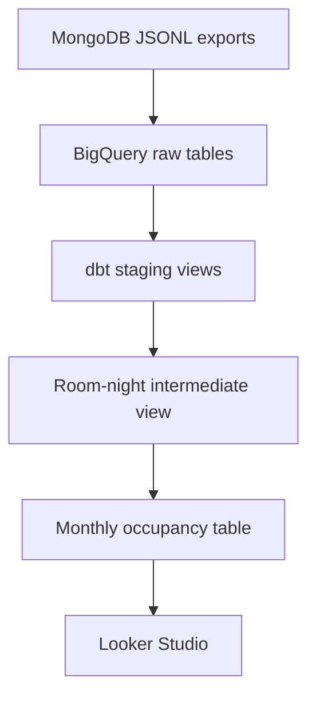

# Cove Occupancy Analytics

An ELT pipeline that loads MongoDB JSONL exports into BigQuery, transforms them with dbt, and reports monthly property occupancy in Looker Studio.

[View the Looker Studio report](https://datastudio.google.com/reporting/e6c3916e-6926-4964-9215-8462a0a5742f)

## Architecture



The supplied JSONL files are loaded into `cove_raw` without business transformations. dbt then performs all typing, normalization, and occupancy calculations inside BigQuery and writes the reporting mart to `cove_analytics`.

## Occupancy definition

The calculation uses one available room-night as its atomic grain:

```text
monthly occupancy rate = occupied room-nights / available room-nights
```

The final mart has one row per property and calendar month.

### Business rules and assumptions

- `checkInDate` is inclusive and `checkOutDate` is exclusive.
- Cancelled tenancies are retained in the raw and staging layers but excluded from the occupancy calculation. All other tenancies are considered valid within their date ranges.
- A property's `lease_end_date` is inclusive.
- A property or room is unavailable from its `deletedAt` date onward, so the deletion date is exclusive.
- Future dates after `CURRENT_DATE()` are excluded.
- Room creation dates are unavailable, so each room is assumed to be available from its property's lease start date.
- Tenancies extending beyond property or room availability are clipped to the available period.
- Overlapping tenancies are counted as occupied only once at the room-night level, while the overlaps themselves are flagged as data quality issues requiring investigation.
- Partial months use only the room-nights that were actually available during that month.

These rules are reasonable defaults for the supplied data. In a production implementation, lease-end inclusivity, deletion-date semantics, time zone, and tenancy-status definitions should be confirmed with the business owner.

## Models

| Layer | Model | Materialization | Purpose |
|---|---|---|---|
| Raw | `properties`, `rooms`, `tenancies` | BigQuery tables | Unmodified JSONL fields stored as strings |
| Staging | `stg_properties`, `stg_rooms`, `stg_tenancies` | Views | Rename fields to snake_case and safely cast dates and timestamps |
| Intermediate | `int_room_nights` | View | Generate one row per available room-night and derive `is_occupied` |
| Mart | `fct_monthly_property_occupancy` | Table | Aggregate occupied and available room-nights by property and month |

Staging and intermediate models are views because this dataset is small and the views keep transformation logic transparent without duplicating storage. The final mart is a table to provide a stable and efficient source for Looker Studio.

## Project structure

```text
.
├── data/                         # Supplied JSONL files
├── models/
│   ├── staging/                  # Typed and renamed source models
│   ├── intermediate/             # Room-night model
│   ├── marts/                    # Monthly occupancy mart
│   └── sources.yml               # BigQuery sources and source tests
├── scripts/
│   └── load_raw_data.sh          # Reproducible raw-table creation and loading
├── sql/                          # DDL and manual validation queries
├── tests/                        # Singular dbt data tests
├── screenshots/                  # BigQuery and Looker Studio evidence
├── dbt_project.yml
├── profiles.yml.example
└── requirements.txt
```

## Setup and execution

### Prerequisites

- Python 3.11+
- Google Cloud SDK with the `bq` command
- A Google Cloud project with BigQuery access
- A BigQuery location set to `US`

### 1. Create the Python environment

```bash
python3 -m venv .venv
source .venv/bin/activate
pip install -r requirements.txt
```

### 2. Authenticate with Google Cloud

```bash
gcloud auth application-default login
gcloud config set project YOUR_GCP_PROJECT_ID
```

### 3. Configure dbt

```bash
mkdir -p ~/.dbt
cp profiles.yml.example ~/.dbt/profiles.yml
```

Replace `your-gcp-project-id` in `~/.dbt/profiles.yml`, then verify the connection:

```bash
dbt debug
```

### 4. Create and load the raw tables

Run from the project root:

```bash
./scripts/load_raw_data.sh YOUR_GCP_PROJECT_ID
```

The script creates the `cove_raw` and `cove_analytics` datasets when needed and reloads the three raw tables from the JSONL files. It uses `--replace`, so rerunning it does not append duplicate records.

### 5. Build and test the dbt project

```bash
dbt build
```

The completed build creates five models and runs 57 data tests. The verified result for the supplied data is:

```text
PASS=62 WARN=0 ERROR=0 SKIP=0
```

## Validation

The repository includes independent SQL checks that can be executed with the BigQuery CLI:

```bash
bq query --location=US --use_legacy_sql=false < sql/validate_raw_sources.sql
bq query --location=US --use_legacy_sql=false < sql/validate_tenancy_overlaps.sql
bq query --location=US --use_legacy_sql=false < sql/validate_room_nights.sql
bq query --location=US --use_legacy_sql=false < sql/validate_monthly_occupancy.sql
```

Property-level totals used for manual reconciliation:

| Property ID | Occupied room-nights | Available room-nights | Occupancy rate |
|---|---:|---:|---:|
| `p_001` | 754 | 910 | 82.86% |
| `p_002` | 638 | 792 | 80.56% |
| `p_003` | 313 | 366 | 85.52% |

For the overlap-sensitive month, `p_002` has 56 occupied room-nights out of 60 available room-nights in June 2025, resulting in 93.33% occupancy rather than a value above 100%.

## Data quality findings

- The source contains 3 properties, 6 rooms, and 16 tenancies. Primary IDs are unique and required relationships are valid.
- `t_015` is cancelled and is excluded from occupancy.
- `t_010` and `t_011` overlap in room `r_202` for 6 nights, from 25 June through 30 June 2025. The room-night model prevents double counting.
- Property `p_003` is deleted on 1 December 2025, and room `r_201` is deleted on 31 December 2025.
- Tenancies `t_006`, `t_009`, and `t_016` extend beyond room or property availability and are clipped by the room-night model.
- `deletedAt` is inconsistently absent or null in the JSONL exports; staging models normalize both cases.

## Tests

The dbt test suite covers:

- unique and non-null identifiers;
- source-to-model relationships;
- accepted tenancy statuses;
- valid lease and tenancy intervals;
- one row per room and occupancy date;
- one row per property and month;
- occupied room-nights not exceeding available room-nights;
- occupancy rates between 0 and 1.

The known tenancy overlap is documented and exposed by a diagnostic SQL query rather than a failing dbt test, because the final occupancy calculation is intentionally resilient to it.

## Looker Studio

The report reads from `cove_analytics.fct_monthly_property_occupancy` and uses:

- dimension: `occupancy_month` at year-month granularity;
- breakdown dimension: `property_name`;
- metric: average `occupancy_rate`, formatted as a percentage;
- missing-data behavior: line breaks rather than zero substitution.

[Open Monthly Occupancy Rate by Property](https://datastudio.google.com/reporting/e6c3916e-6926-4964-9215-8462a0a5742f)

## Scope and production considerations

This implementation does not include Airflow, CI/CD, Terraform, or incremental models.

For production-scale data, the room-night model should be incremental and partitioned by occupancy date, with scheduled ingestion, monitoring, and explicit late-arriving-data handling.
